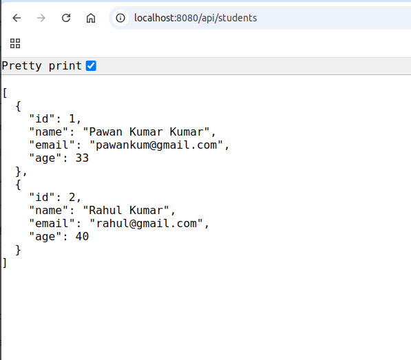

# glonag-first
## Setup
 Download from officially website.
## if you are using ubuntu then follow listed steps.
 1. sudo wget https://go.dev/dl/go1.22.0.linux-amd64.tar.gz
 2. sudo tar -C /usr/local -xzf go1.22.0.linux-amd64.tar.gz
 3. nano ~/.bashrc
 ## copy paste listed code in above file
       export PATH=$PATH:/usr/local/go/bin
       export GOPATH=$HOME/go 
       export PATH=$PATH:$GOPATH/bin
## Save and exit, then run below commond
       source ~/.bashrc
## check version 
       go version
## run file
       go run hello.go

## Initialize Directory
## If your project is not in /home/go/src, then you can do any where and need to execute below commond in project.
       go mod init goLangThird

# tutorial link
https://www.youtube.com/watch?v=_utEjVtOwFE&list=PLzjZaW71kMwSEVpdbHPr0nPo5zdzbDulm&index=13
00:10

## Start server
 go run ./cmd/students-api/main.go -config config/local.yaml

https://www.youtube.com/watch?v=OGhQhFKvMiM&t=6218s
 2:03:01

 ## Postman
 url - localhost:8080/api/students [POST] studentAdd
 url - localhost:8080/api/students/1 [GET] studentFetch
 url - localhost:8080/api/students [GET] studentList
 request - {
    "name":"Pawan",
    "email":"pawankum0010@gmail.com",
    "age":37
}  

## Sqlite GUI
Need to install a sqlite GUI. [I have install TablePlus]
After install create db [student], and select a storage path.

## GET APi

## Add a folder in root
storage/storage.db

## For student API Folder
1. cmd/student-api
2. internal